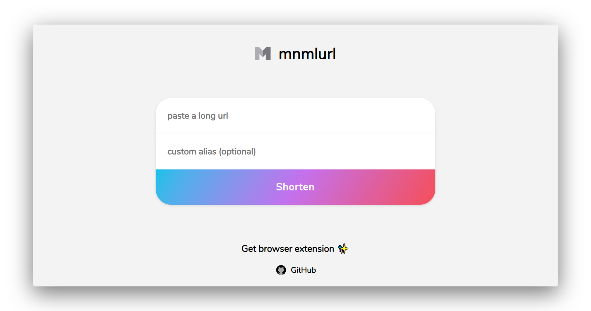

```
When I wrote this, only God and I understood what I was doing. Now, only God knows.
```
<div align="center">
  <a href="https://liyas-thomas.firebaseapp.com"></a>
  <br>
  <h1>Liyas Thomas</h1>
  <sub>Built with ❤︎ by
  <a href="https://github.com/liyasthomas">liyasthomas</a> and
  <a href="https://github.com/liyasthomas/mnmlurl-extension/graphs/contributors">contributors</a>
	</sub>
</div>

---

[](https://travis-ci.org/liyasthomas/mnmlurl-extension) [](https://github.com/liyasthomas/mnmlurl-extension/releases/latest) [](https://github.com/liyasthomas/mnmlurl-extension/archive/master.zip) [](https://github.com/liyasthomas/mnmlurl-extension/blob/master/LICENSE) [](https://github.com/liyasthomas/mnmlurl-extension/issues) [](https://mnmlurl.ml) [](https://www.paypal.me/liyascthomas)

#  mnmlurl-extension

### :information_desk_person: Browser extension for mnmlurl by [Liyas Thomas](https://github.com/liyasthomas)

<div align="center">
  <br>
  
  
  <br>
</div>

### Features :sparkles:

:eyeglasses: **Free and open source.**: [mnmlurl](https://mnmlurl.ml) is a modern URL shortener with support for custom alias.

:globe_with_meridians: **Custom alias support**: Choose your own alias or get a random one!

:electric_plug: **Lighting fast**: No ads, no logging, no BS!

:zap: **Performance**: Uses [jsonstore.io](https://www.jsonstore.io) for data storage.

:heart: **Free**: It's free and always will be.

---

## Getting started

These instructions will get you a copy of the project up and running on your local machine for development and testing purposes. See deployment for notes on how to deploy the project on a live system.

### Prerequisites

What things you need to install the extension and how to install them.

* Internet connection
* Browser
* [Wonder](https://en.wikipedia.org/wiki/Wonder_(emotion))! :heart:

### Installing

1. Download the [latest release](https://github.com/liyasthomas/mnmlurl-extension/releases/latest) on this repository.
2. Unzip.
3. Load extension locally on your computer:
	> #  **Chrome:**

		1. Visit: chrome://extensions
		2. Enable "Developer mode".
		3. Click: Load unpacked > choose extension's folder > Ok.

	> #  **Firefox:** [Download add-on](https://addons.mozilla.org/en-US/firefox/addon/mnmlurl)

		1. Visit: about:debugging
		2. Click: Load Temporary Add-on > choose manifest.json within the extension's folder > Ok.

	> #  **Opera:**

		1. Visit: opera://extensions
		2. Enable "Developer mode".
		3. Click: Load unpacked > choose extension's folder > Ok.

	> #  **Edge:**

		1. Visit: about:flags
		2. Check the "Enable extension developer features".
		3. Click on "…" in the Edge’s navigation bar > Extensions.
		4. Click: Load extension > choose extension's folder > Ok.
4. Done!

---

## Built with

* **[Chromium](https://github.com/chromium/chromium)** - Thanks for being so fast!
* HTML - For the web framework
* CSS - For styling components
* JavaScript - For magic!

---

## Contributing

Please read [CONTRIBUTING](CONTRIBUTING.md) for details on our [CODE OF CONDUCT](CODE_OF_CONDUCT.md), and the process for submitting pull requests to us.

---

## Continuous Integration

We use [Travis CI](https://travis-ci.com) for continuous integration. Check out our [Travis CI Status](https://travis-ci.org/liyasthomas/mnmlurl-extension).

---

## Versioning

This project is developed by [Liyas Thomas](https://github.com/liyasthomas) using the [Semantic Versioning specification](https://semver.org). For the versions available, see the [releases on this repository](https://github.com/liyasthomas/mnmlurl-extension/releases).

---

## Change log

See the [CHANGELOG](CHANGELOG.md) file for details.

---

## Authors

### Lead Developers
* [**Liyas Thomas**](https://github.com/liyasthomas) - *Author*

### Testing and Debugging
* [Liyas Thomas](https://github.com/liyasthomas)

### Contributors
* [Liyas Thomas](https://github.com/liyasthomas)

### Thanks
* [Google](https://www.google.com) - For samples

See the list of [contributors](https://github.com/liyasthomas/mnmlurl-extension/graphs/contributors) who participated in this project.

---

## License

This project is licensed under the [MIT License](https://opensource.org/licenses/MIT) - see the [LICENSE](LICENSE) file for details.

---

## Acknowledgments

* Hat tip to anyone who's code was used
* Inspirations:
	* [Kutt.it](https://kutt.it/)
